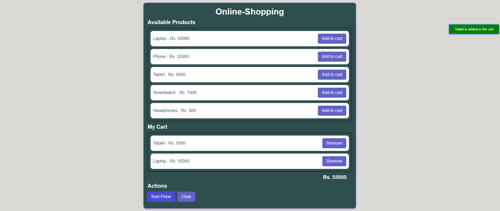

# 🛒 Online Shopping Cart

This is a simple **Online Shopping Cart** web application built using **HTML**, **CSS**, and **JavaScript**.

It allows users to:
- View a list of available products
- Add unique products to the cart
- Remove products from the cart
- Sort cart items by price
- Clear the cart
- Get real-time feedback messages for all actions

---

## 🚀 Live Demo

👉 [Click here to view the deployed site](https://stack-naveen.github.io/online-shopping-cart/)

> Replace the link with your actual GitHub Pages URL after deployment.

---

## 📂 Project Structure

```
online-shopping-cart/
├── index.html         # Main HTML file
├── styles.css         # CSS for styling
├── script.js          # JavaScript for functionality
└── images/
    └── demo.png       # Screenshot image
```

---

## 💻 Technologies Used

- HTML5  
- CSS3  
- JavaScript (Vanilla)

---

## ✨ Features

- Responsive product list and cart layout
- Real-time feedback using floating message
- Prevents duplicate entries in the cart
- User-friendly UI with hover effects
- Total price calculation

---

## 📸 Screenshots



---

## 📌 How to Use

1. Clone or download the repository
2. Open `index.html` in your browser
3. Enjoy adding/removing/sorting products!

---

## 📈 Future Enhancements

- Add product images
- Save cart using local storage
- Add quantity selection
- Responsive mobile design
- Payment gateway integration (for demo)

---

## 🧑‍💻 Author

**Naveen**  
> GitHub: [stack-naveen](https://github.com/stack-naveen)

---

## 📝 License

This project is licensed under the MIT License.

```
MIT License

Copyright (c) 2025 Naveen

Permission is hereby granted, free of charge, to any person obtaining a copy
of this software and associated documentation files (the "Software"), to deal
in the Software without restriction, including without limitation the rights  
to use, copy, modify, merge, publish, distribute, sublicense, and/or sell  
copies of the Software, and to permit persons to whom the Software is  
furnished to do so, subject to the following conditions:

The above copyright notice and this permission notice shall be included in  
all copies or substantial portions of the Software.

THE SOFTWARE IS PROVIDED "AS IS", WITHOUT WARRANTY OF ANY KIND, EXPRESS OR  
IMPLIED, INCLUDING BUT NOT LIMITED TO THE WARRANTIES OF MERCHANTABILITY,  
FITNESS FOR A PARTICULAR PURPOSE AND NONINFRINGEMENT. IN NO EVENT SHALL THE  
AUTHORS OR COPYRIGHT HOLDERS BE LIABLE FOR ANY CLAIM, DAMAGES OR OTHER  
LIABILITY, WHETHER IN AN ACTION OF CONTRACT, TORT OR OTHERWISE, ARISING FROM,  
OUT OF OR IN CONNECTION WITH THE SOFTWARE OR THE USE OR OTHER DEALINGS IN  
THE SOFTWARE.
```
